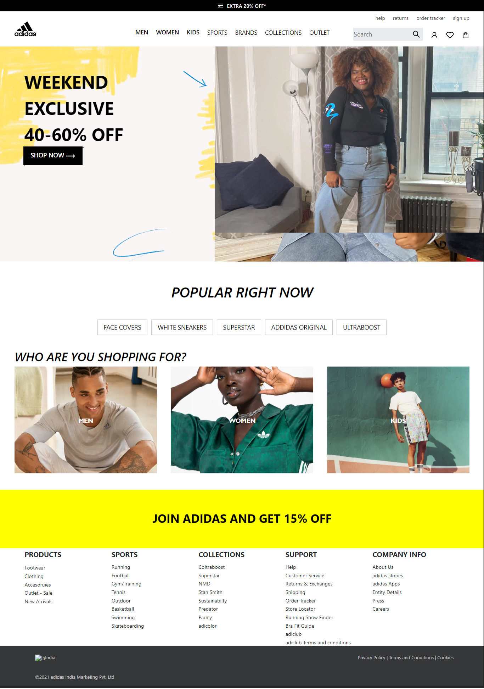

<h2 align="center">Adidas Clone using React.</h2>

- Welcome to our repositary, here we have created a clone of Adidas India.

- This project was made with the help for <strong>Venkatesh</strong>

- This is a non functional clone for the website using React. We used various React Libraries to achieve our goal such as React , Redux , React-Bootstrap , React-Icons , React-router-dom , React-player to make the website for user friendly and pleasing by looks. This website is responsive. 

<h4 >Contributors</h4>
<ul>
<li>Anmol Jain</li>

</ul>
<h2 align="center">Full Screen Home Page</h2>

<h2 align="center">Mobile Screen Home Page</h2>

<h2 align="center">Navigation</h2>

https://user-images.githubusercontent.com/96873348/163381490-75ca1d7e-c66f-4dd3-b48d-7a1963a07cb3.mp4

